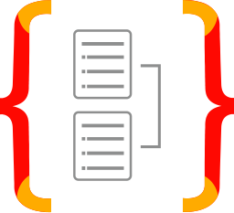

# ¡Hola! Soy Jorge Nicolás Fernández Gamarra 👋

Soy un **Desarrollador Full Stack** apasionado por transformar desafíos en soluciones robustas y escalables. Mi camino hacia el desarrollo web está impulsado por una sólida ética de trabajo, disciplina y una persistencia inquebrantable, cualidades forjadas en experiencias que me han enseñado a avanzar sin importar la adversidad.

---

### 🛠️ **Mis Habilidades Técnicas**

Como Desarrollador Full Stack, poseo un dominio actualizado de las tecnologías clave para el desarrollo web moderno, con una especial inclinación hacia el backend.

### **Lenguajes de Programación:**

 

---

### **Frameworks y Librerías:**

#### **Backend:**

  

#### **Frontend:**

  

#### **Estado:**

---

### **Bases de Datos y ORMs:**

 

---

### **Herramientas de Desarrollo:**

        

---

### **Servicios Cloud:**

---

### **Metodologías Ágiles:**

---

### **Herramientas de Colaboración:**

  
 

---

### **Servicios Cloud:**

*  Cloudinary

---

### **Metodologías Ágiles:**

*  Scrum

---

### **Herramientas de Colaboración:**

*  Jira
*  Confluence
*  Slack
  
---

### 💻 **Proyectos Destacados**

#### **E-commerce JNFG**

* **Descripción:** Plataforma de e-commerce completa, permitiendo registro/login de usuarios, gestión de compras y generación de órdenes de compra. Incluye panel de administración para productos.

* **Mi Rol:** Desarrollo integral del **Backend**, incluyendo la lógica de negocio, la API RESTful para productos y órdenes, autenticación/autorización y gestión de la base de datos.

* **Tecnologías Clave:** Node.js, NestJS, Express.js, PostgreSQL, TypeORM, JWT, Bcrypt, Cloudinary.

* **Repositorio:** [https://github.com/pi-rym/PM4BE-JNicolasFernandezG](https://github.com/pi-rym/PM4BE-JNicolasFernandezG)

---

### 🌱 **Aspiraciones y Próximos Pasos**

Mi objetivo es llegar a ser un **Senior Developer** en una empresa de primer nivel, aspirando a desafíos internacionales y a la excelencia continua. Este camino es solo el comienzo; mi motivación es inagotable, buscando siempre explorar nuevas fronteras en el vasto mundo de la programación y consolidar mis conocimientos en arquitectura de software.

---

### 📬 **Conecta Conmigo**

Estoy listo para aplicar mi compromiso, disciplina y pasión a tu próximo proyecto. ¡Conectemos!

* **Correo Electrónico:** nicolas.fernandezgamarra@gmail.com

* **LinkedIn:** www.linkedin.com/in/jorge-nicolas-fernandez-gamarra

* **Mi Perfil de GitHub:** [https://github.com/JNicolasFernandezG](https://github.com/JNicolasFernandezG)
